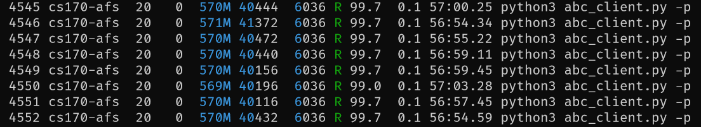

# CS170 Project Reflection

Tom Shen, Ziang Gao, Alan Zhu

## Algorithms

Our algorithm is inspired by *artificial bee colony algorithms* with some modifications. This is a randomized online algorithm. 

First, let's declare some helper procedures, which are useful for our algorithm workflow: 

- `scout`: This function can quickly generate a random solution with relatively high cost. 
- `work`:  This function can take in a solution and try to find a new solution that is slightly better than the given solution (i.e. a solution with lower cost). 

Here are the main workflow: 

- **Create some number of workers.** Each worker use `scout` to get a random solution and keep it. 
- **Repeat the following procedures for a certain amount of iterations.** Track the best solution we got so far. 
  - Each worker already has a solution at this step. Each worker tries to call `work` to find a better solution. The worker is moving toward the local optimum. 
  - Next, randomly select two workers, and choose a worker who has a solution with lower cost. Let this worker call `work` again. 
  - If a worker has not improved its solution for a certain amount of iterations, the worker will call `scout` to find another random solution. 
  - If the best solution is not improved over a certain amount of iterations, end this loop. 
- After we manually terminate the program, the program will return the best solution ever observed. 

**How does `scout` work**: 

- We use MST and SPT as the heuristics to create random graph. First, given graph $$G$$, we sample a graph $$G'$$ so that each $$\forall e' \in G', w(e') = w(e) * \mbox{Normal}(1, \sigma)$$ where $$e$$ is the corresponding edge in $$G$$ and $$\sigma$$ is configurable. We randomly select whether we want to use MST or SPT as heuristics. 
- If we use MST, we calculate MST on $$G'$$ and check which edges are in tree. Return those edges. 
- If we use SPT, we randomly select a starting point and run Dijkstra's. Return edges in the resulting SPT. 

**How does `work` work**: 

- We use leaf pruning in this method. Program randomly selects a leaf in the tree. 
- Try to remove the leaf:
  - If after removal, the solution is no longer valid, do not remove this leaf. 
  - If after removal, the solution is valid but has higher cost, than the program will remove this leaf in a small probability. 
  - If after removal, the solution is valid and has lower cost, remove the leaf. 

### How we calculate multiple files concurrently: 

- Create $$N$$ processes using python `multiprocessing` library. Assign input randomly to each thread. ($$N$$ = number of logical CPUs in this machine)
- For each process, run each task serially. 

### Why we think this algorithm is good: 

- **Randomness**: the goal of the program is to find a **minimum connected dominating set** of a graph. There's no deterministic algorithm found that can solve this question in polynomial time. Also, simply use MST or SPT with greedy leaf pruning does not generate a very good solution because

  - There are too many ways to prune the tree
  - Pruning a leaf may increase the cost. 
  - Minimum connected dominating set is not necessarily a subset of some MST or SPT. 
  - One fixed strategy may work well on a specific tree and perform bad on others. 

  Therefore, we rely on randomness. A near-best solution can be found with a high probability given enough number iterations and good heuristics. 

- **Solution Quality: ** For each iteration we have multiple "workers". The probability of finding a better solution is much higher than only focusing on one working solution in an iteration. Also, the answer can only get better and better. 

## Other approaches we tried

- **Greedy leaf pruning:** In this algorithm we choose a random SPT or MST in the graph and keeps pruning leaves until it is impossible to prune more leaves. This algorithm has around 30% higher cost because minimum connected dominating set may not be in any MST or SPT.
- **Naïve worker**: In this algorithm, we only has one `worker` at a time. Keep call `work` on the worker until the worker cannot find a better answer and repeat. This algorithm has 15% higher cost compared with the algorithm we used (giving some computation power and computational time). 
- **Zero-Temperature Approach: ** This approach is almost the same as the algorithm we used, with the exception that when pruning the leaf, if after pruning the cost increases, the algorithm will not remove the leaf **definitely** (while in our algorithm, there's still a small possibility to remove this leaf). Performance of this approach is a little bit worse (around 5%) because the algorithm may be stuck the saddle point. 

## Computational Resources

We use instructional machines for computation. Here are some details: 

```
Server: hive13
Address: hive13.cs.berkeley.edu
Running Time: ~144 hours
Process name: ./abc_client.py --parallel
```

Here's the `htop` information related to the computation task: 



